# HW 4

For this project, I made a canyons-like terrain using Houdini's built-in erosion tools. I then scattered some randomly generated "void crystals" across the scene, added some amonguses for extra flair, and included distance fog and a AI-generated background as well.

## Terrain

The terrain made heavy use of file caching since some of the steps took a long time to compute. The most significant one was probably the main erosion step, which I ran for 100 frames.

The first step was to add simple noise-based displacement, using a combination of the default noise and Worley noise:

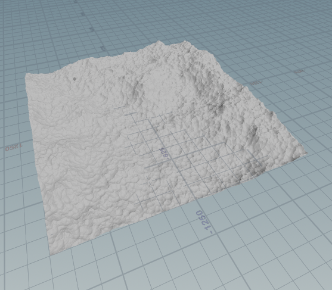

I then scattered some sussy impostors across the terrain using a heightfield scatter node, and combined them into the terrain using a heightfield project node:

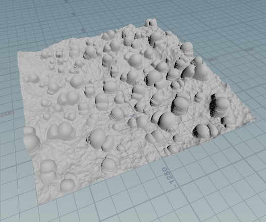

After adding some noise, distorting the terrain, and remapping the height, it looked a lot more like mountains:

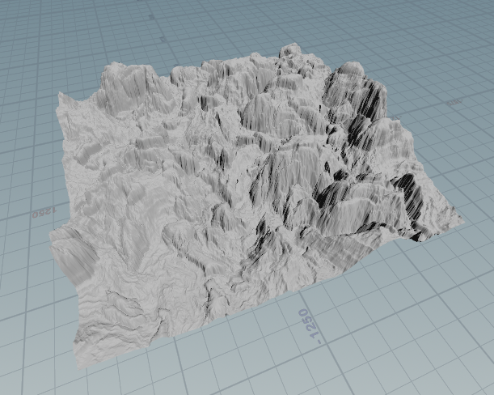

Then came the main erosion pass, which ran for 100 frames:

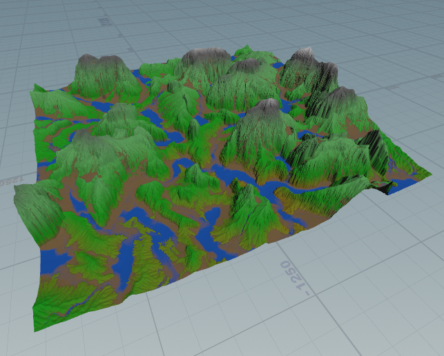

I put the first file cache here since that step took a while to calculate. Next came terracing and a bit more erosion:

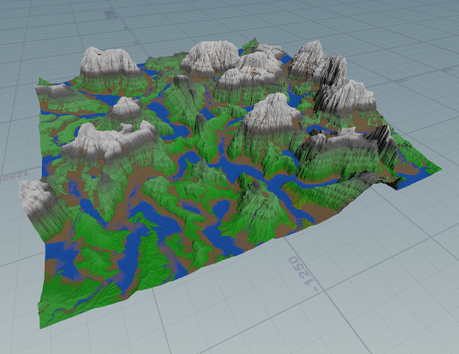

After converting the heightfield to a mesh, I used poly reduce nodes to remove unnecessary polygons from terrain outside the camera frustum:

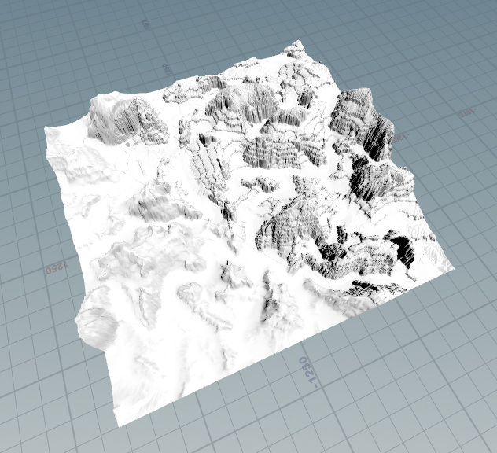

## Scattering

The crystals are also scattered only on the part of the terrain within the camera frustum:

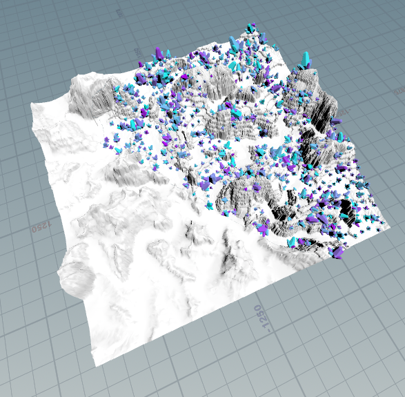

Each crystal is unique. A single one looks like so:

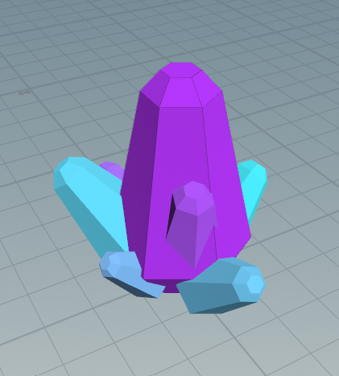

I didn't put the terrain logic into an HDA due to the amount of file caches I used, but I did extract the scattering node network into an HDA. It has parameters for the size/placement of the crystals, as well as one seed for the scattering and one seed for the appearance of the crystals themselves:

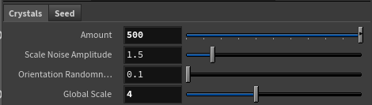
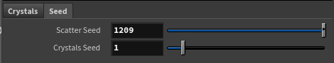

## Finshing Touches

I placed one big amogus in the background where he would be slightly covered in distance fog, and another in the foreground with a top hat. The camera focuses on the amogus in the foreground, but the depth of field effect is not very strong as I felt that gave the wrong sense of scale.

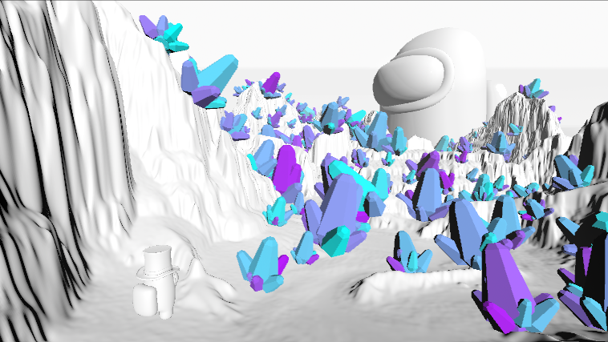

The amogus model is from [here](https://sketchfab.com/3d-models/among-us-astronaut-clay-20b591de51eb4fc3a4c5a4d40c6011d5), and the top hat model is from [here](https://sketchfab.com/3d-models/top-hat-acc9845b7c48479c9b23d93d3643612f).

The fog itself is a cylinder with a volumetric material applied. The density is stronger at points further away from the camera, and it also falls off exponentially with height. 

The terrain is a simple mix of a water material with noise displacement, a canyon material with horizontal stripes generated with noise, and a green "grass" material present near the water.

Lastly, I used a sky texture I generated using Midjourney:

I added some birds on top to help show the scale of the terrain.

## Other

Here's an older version that I ended up redoing since I didn't like it as much:

